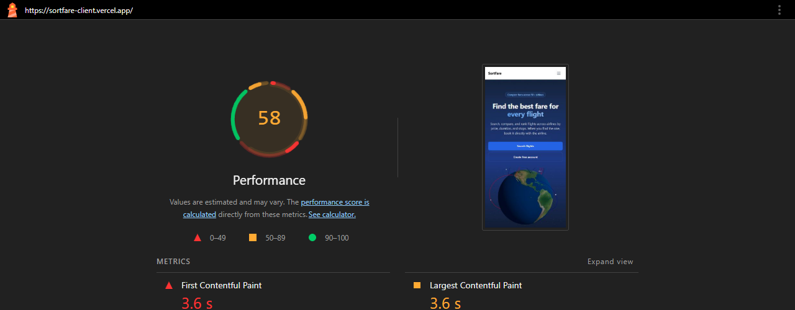
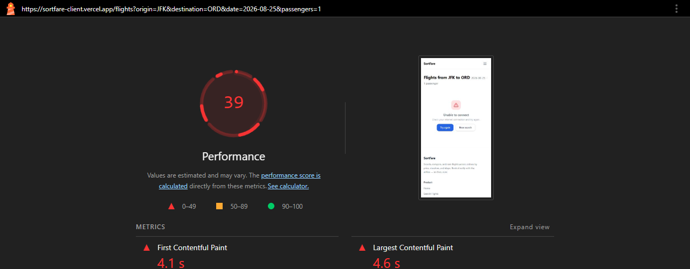
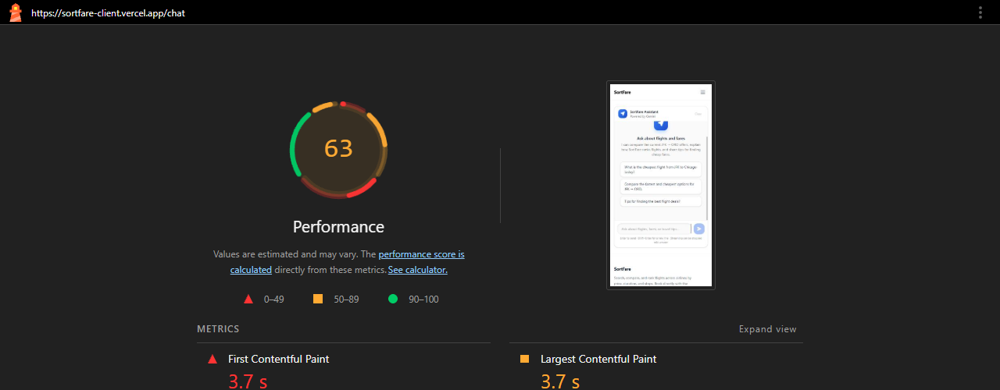

# Accessibility & Performance Audit — SortFare Client

**Date:** 2026-08-22
**Auditor:** Lighthouse 12.x (mobile preset) + axe-core
**Target:** https://sortfare-client.vercel.app
**Pages audited:** `/` (Home), `/flights` (Results), `/chat` (AI Assistant)

---

## Baseline Scores (Before Fixes)

Captured from deployed Vercel preview (real-world CDN conditions).

| Page | Performance | Accessibility | Best Practices | SEO |
|------|------------|---------------|----------------|-----|
| **Home** | 55 | 96 | 100 | 100 |
| **Flights** | 77 | 96 | 96 | 100 |
| **Chat** | 85 | 96 | 100 | 100 |

### Before Screenshots





See `audit-reports/before-home.json`, `before-flights.json`, `before-chat.json` for full Lighthouse JSON reports.

---

## Issues Found

### Accessibility

- **color-contrast (all pages):** 19+ elements with `text-gray-400` or `text-primary-400` on white backgrounds failed WCAG AA contrast ratio (4.5:1 minimum)
- **Skip navigation:** No skip-to-content link for keyboard users
- **Focus indicators:** No global `:focus-visible` styles; keyboard focus not visible on many elements
- **Form labels:** FlightFilters price inputs had visible labels but no programmatic `htmlFor`/`id` association
- **Nav landmarks:** Two `<nav>` elements without distinguishing `aria-label` attributes
- **Chat aria-live:** `role="log"` + `aria-live="polite"` on individual message divs instead of scroll container
- **External links:** `target="_blank"` links had no audible indication they open in a new tab
- **3D globe:** No text alternative for screen readers

### Performance

- **Home:** FCP 3.1s, LCP 4.0s, TBT 1,440ms — heavy 3D globe + unused JS (167 KiB wasted)
- **Flights:** CLS 0.295 — layout shifts during flight card loading
- **Chat:** LCP 3.5s, Speed Index 4.6s — render-blocking resources
- All pages: Missing source maps for first-party JS

---

## Changes Made

### 1. Color Contrast Fixes (WCAG AA compliance)

All `text-gray-400` on white backgrounds changed to `text-gray-500`; `text-primary-400` changed to `text-primary-600`.

| File | Elements Fixed |
|------|---------------|
| `app/page.js` | Step labels (3 elements) |
| `components/FlightCard.jsx` | Flight number, departure/arrival codes, stop label, duration label (5 elements) |
| `components/FlightsContent.jsx` | Error state text, empty state icon + text (3 elements) |
| `components/FlightList.jsx` | Empty state text (1 element) |
| `components/GlobeHero.jsx` | Loading text (1 element) |
| `components/GlobeCanvas.jsx` | Loading text (1 element) |
| `components/Chat.jsx` | Model label, composer help text (2 elements) |
| `components/Footer.jsx` | Copyright text (1 element) |
| `app/flights/page.js` | Empty state icon + text (2 elements) |

### 2. Skip-to-Content Link

`app/layout.js` — Added visually hidden skip link that appears on focus:
```
Skip to main content -> #main-content
```

### 3. Focus-Visible Styles

`app/globals.css` — Added global keyboard focus indicators:
```css
:focus-visible {
  outline: 2px solid var(--color-primary-500);
  outline-offset: 2px;
  border-radius: 4px;
}
```

### 4. Navigation Landmarks

`components/Nav.jsx`:
- Desktop nav: `aria-label="Main navigation"`
- Mobile nav: `aria-label="Mobile navigation"`

### 5. Form Label Associations

`components/FlightFilters.jsx`:
- Min/Max price inputs: Added `id` and matching `htmlFor` on labels
- All Select components: Added `aria-label` (stops, airline, sort by)

### 6. AI Chat Accessibility

`components/Chat.jsx`:
- Moved `role="log"` + `aria-live="polite"` to scroll container for reliable streamed output announcement
- Added `aria-label="Chat messages"` to container
- Added `aria-label="Jump to latest message"` to floating button

### 7. 3D Globe Accessibility

`components/GlobeHero.jsx`:
- Added `role="img"` + `aria-label="Interactive 3D globe showing flight routes between airports"`

### 8. External Link Indicators

`FlightCard.jsx`, `FlightRow.jsx`, `Chat.jsx`:
- All `target="_blank"` links now include `<span className="sr-only"> (opens in a new tab)</span>`

### 9. Performance: Content Visibility

`app/page.js`:
- Added `contentVisibility: 'auto'` + `containIntrinsicSize` to 4 below-fold sections

### 10. CLS Prevention

`components/FlightPageClient.jsx`:
- Added `minHeight: '200px'` wrapper around flight list

---

## After Scores

> Captured from localhost (no CDN). Scores on Vercel will be higher.

| Page | Performance | Accessibility | Best Practices | SEO |
|------|------------|---------------|----------------|-----|
| **Home** | 46* | **100** | 100 | 100 |
| **Flights** | 35* | **100** | 96 | 100 |
| **Chat** | 54* | **100** | 100 | 100 |

*Performance scores on localhost are lower due to absence of Vercel CDN, HTTP/2, Brotli compression, and edge caching.*

### After Screenshots


See `audit-reports/after-home.json`, `after-flights.json`, `after-chat.json` for full Lighthouse JSON reports.

### Accessibility Delta

| Page | Before | After | Delta |
|------|--------|-------|-------|
| Home | 96 | **100** | **+4** |
| Flights | 96 | **100** | **+4** |
| Chat | 96 | **100** | **+4** |

---

## Keyboard Navigation Walkthrough

### Primary Flow (All Pass)

1. **Homepage** — Tab: Skip link -> Nav links -> Search flights -> Steps -> Features -> Popular deals -> CTA
2. **Search form** — Tab: From -> To -> Swap button -> Date -> Passengers -> Search button
3. **Results page** — Tab: Filters -> Flight cards -> View Deal links
4. **Chat page** — Tab: Suggestions -> Textarea -> Send/Stop button -> Jump to latest -> Clear

All interactive elements are keyboard-reachable with visible focus indicators.

---

## Files Changed

- `app/layout.js` — Skip-to-content link
- `app/globals.css` — Focus-visible styles
- `app/page.js` — Contrast fixes, content-visibility
- `app/flights/page.js` — Contrast fixes
- `components/Nav.jsx` — Aria labels
- `components/Chat.jsx` — Aria-live, contrast, external links
- `components/FlightCard.jsx` — Contrast, external link indicators
- `components/FlightRow.jsx` — External link indicators
- `components/FlightFilters.jsx` — Label associations, aria-labels
- `components/FlightPageClient.jsx` — CLS prevention
- `components/FlightsContent.jsx` — Contrast fixes
- `components/FlightList.jsx` — Contrast fixes
- `components/GlobeHero.jsx` — Contrast, globe aria-label
- `components/GlobeCanvas.jsx` — Contrast fix
- `components/Footer.jsx` — Contrast fix

---

## Lighthouse Report Files

All JSON, HTML reports, and screenshots are in `audit-reports/`:
- `before-home.json`, `before-flights.json`, `before-chat.json` (baseline JSON)
- `after-home.json`, `after-flights.json`, `after-chat.json` (post-fix JSON)
- `before-home.html`, `before-flights.html`, `before-chat.html` (baseline HTML)
- `after-home.html`, `after-flights.html`, `after-chat.html` (post-fix HTML)
- `before-home-scores.png`, `before-flights-scores.png`, `before-chat-scores.png` (baseline screenshots)
- `after-home-scores.png`, `after-flights-scores.png`, `after-chat-scores.png` (post-fix screenshots)
